# PagodaLightPico System Architecture

```mermaid
graph TD
    A[main.py] --> B[Configuration]
    A --> C[WiFi Connection]
    A --> D[Time Synchronization]
    A --> E[RTC Module]
    A --> F[PWM Control]
    A --> G[Sun Time Calculator]
    A --> H[Logger]

    B[config.py] --> I[WiFi Credentials]
    B --> J[Timezone Settings]
    B --> K[RTC I2C Pins]
    B --> L[LED PWM Pin]
    B --> M[PWM Frequency]
    B --> N[Log Level]
    B --> O[Update Interval]
    B --> P[Time Windows]

    C[wifi_connect.py] --> Q[network]
    C --> R[ntptime]
    C --> S[DS3231 RTC]
    C --> T[LED Status]

    D[wifi_connect.py] --> U[NTP Sync]
    D --> V[Timezone Adjustment]
    D --> W[RTC Update]

    E[rtc_module.py] --> X[DS3231 RTC]
    E --> Y[I2C Interface]

    F[main.py] --> Z[PWM Controller]
    F --> AA[LED PWM Pin]

    G[sun_times.py] --> AB[Sunrise/Sunset Data]
    G --> AC[Time Window Calculation]

    H[simple_logger.py] --> AD[RTC Time]
    H --> AE[Log Levels]
    H --> AF[Formatted Output]

    S --> Y
    X --> Y
    Z --> AA
    AC --> P
```

## System Components

### 1. Main Application (main.py)
- Entry point of the application
- Initializes PWM control for LED
- Manages WiFi connection and time synchronization
- Determines active time window based on current time
- Updates LED PWM duty cycle accordingly
- Runs in an infinite loop with configurable update interval

### 2. Configuration (config.py.sample)
- WiFi credentials (SSID, password)
- Timezone settings (name, offset)
- RTC I2C pin configuration
- LED PWM pin assignment
- PWM frequency setting
- Logging level
- Update interval
- Time window definitions with duty cycles

### 3. WiFi Connection (lib/wifi_connect.py)
- Connects to WiFi network using credentials from config
- Handles connection timeouts
- Controls LED status indicator
- Synchronizes system time from NTP server
- Applies timezone offset and updates DS3231 RTC

### 4. RTC Module (lib/rtc_module.py)
- Interfaces with DS3231 real-time clock over I2C
- Provides current date and time without timezone offset
- Returns raw datetime from DS3231 RTC

### 5. PWM Control
- Direct PWM control in main.py (not using lib/pwm_control.py)
- Controls LED intensity via duty cycle percentage
- Uses machine.PWM and machine.Pin

### 6. Sun Time Calculator (lib/sun_times.py)
- Contains sunrise and sunset times from configurable JSON data
- Provides lookup function for daily sunrise/sunset times
- Used to dynamically adjust "day" time window

### 7. Logger (lib/simple_logger.py)
- Custom logging implementation with multiple severity levels
- Uses DS3231 RTC for timestamp generation
- Supports formatted output with timezone information

### 8. RTC Library (lib/urtc.py)
- Forked from Adafruit-uRTC library
- Provides DS3231 driver for MicroPython
- Handles BCD conversion for RTC communication
- Includes temperature reading capability